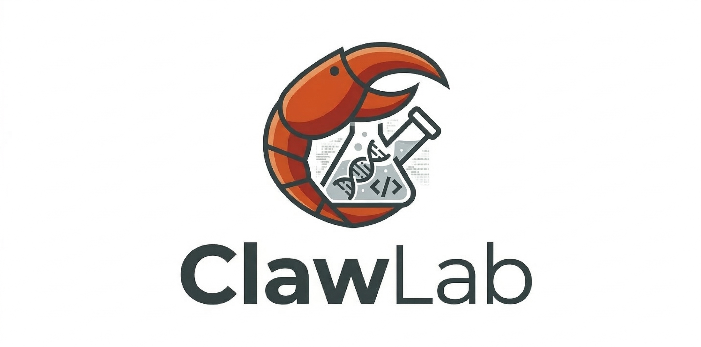

<div align="center">
  

  <h1>ClawLab: Build your virtual research company ! </h1>

</div>

ClawLab 是一个面向研究生、博士生和研究型创作者的 Python-first CLI 系统。  
它不是网页工具，也不是一个只会临时回答问题的 Agent demo。  
它的目标是把你的本地仓库，逐步变成一个会积累经验、会沉淀 SOP、会越来越懂你的虚拟研究公司。

在 ClawLab 里：

- 你是老板 / 创始人
- 员工负责读材料、做规划、写草稿、做复核
- 经理负责派单、交接、复核、补救
- 公司会把经验写回 handbook、playbook、project memory

当前推荐的使用方式是：先接入 API，再运行你的虚拟研究公司。  
ClawLab 仍然保留本地规则版 fallback，但它现在是兜底路径，不再是推荐主路径。

## 为什么研究者需要 ClawLab

研究工作里最耗时间的，往往不是“不会做”，而是反复做这些事情：

- 每次都要重新解释自己的研究背景
- 每次都要重新把项目上下文讲一遍
- 材料、笔记、草稿、修改意见散在不同地方，复用率很低
- AI 虽然能生成内容，但不会真正记住你的项目和风格
- 你改了很多稿子，却很难把这些修改沉淀成以后可复用的规则

ClawLab 想解决的就是这个问题：

> 不只是帮你生成一次，而是把每一次工作都变成以后还能继续利用的公司资产。

它当前最重要的价值不是“更花哨地生成”，而是：

- 让公司知道你是谁
- 让公司知道你当前在做什么
- 让员工按岗位协作完成工作
- 让经验持续写回本地仓库

## 你可以把它理解成什么

你可以把 ClawLab 理解成：

- 一个本地研究工作流内核
- 一个可持续积累的虚拟研究公司
- 一个把材料、草稿、修订、规则、SOP 串起来的 CLI 仓库

它当前不是：

- 网页产品
- 联网检索型科研平台
- 复杂 swarm 系统
- 多用户团队管理系统

## 快速上手

### 1. 安装

在仓库根目录执行：

```bash
python3 -m pip install --user -e . --no-build-isolation
```

### 2. 先配置 API

```bash
export OPENAI_API_KEY=your_key_here
```

ClawLab 当前默认按 API-first 范式运行：

- materials 默认优先走增强版
- planning 默认优先走增强版
- drafts 默认优先走增强版
- learning 默认优先走增强版

如果没有配置 key，系统不会崩，但会回退到规则版，体验会明显变弱。

### 3. 初始化你的公司工作区

```bash
clawlab init
```

### 4. 可选：先导入你的简历

如果你手头已经有简历，推荐先导入。这样后面的 founder / company / team 初始化会更顺，很多问题系统可以直接带默认值。

```bash
clawlab ingest-cv examples/cv.txt
```

这一步会创建或更新你的研究者档案，作为后续 founder / boss context 的底座。

### 5. 启动公司 onboarding

```bash
clawlab company init
```

你会得到：

- 本地 `workspace/`
- founder / company / team 配置
- 一家最小可运行的虚拟研究公司
- 如果你还没有导入简历，`company init` 会先用几条最小问题帮你创建基础 researcher profile
- 如果还没有 active project，`company init` 会顺手带你创建第一个项目
- 完成后会直接给出一条可复制的第一份 `job run` 命令

### 6. 创建当前项目

如果你已经在 `company init` 里建好了第一个项目，这一步可以跳过。

```bash
clawlab project create
```

你可以：

- 直接粘贴项目说明
- 指定一个文件路径
- 输入一大段文字

系统会从真实材料里生成 `ProjectCard`，而不是只让你填碎片化表单。

### 7. 查看公司状态

```bash
clawlab company status
```

你会看到：

- 公司名称 / mission
- 当前团队
- active project / active mission
- recent jobs
- recent deliverables
- handbook / memory 更新

### 8. 给公司派一个工作

```bash
clawlab job run literature-brief \
  --project <project_id> \
  --input examples/task_input.txt \
  --goal "给我一份更聚焦的文献综述 brief"
```

或者：

```bash
clawlab task run literature-outline \
  --project <project_id> \
  --input examples/task_input.txt
```

区别是：

- `job run` 是经理统筹模式，按员工链路执行
- `task run` 是底层技术能力，直接跑单任务

### 9. 修改草稿，然后让公司学习

```bash
clawlab learn --task <task_id> --revised examples/revised_outline.md
```

这一步会把修订结果写回：

- company handbook
- employee playbook
- project memory
- task-level trace

## 5 分钟理解 ClawLab 的工作方式

当前最小闭环是：

```text
init
-> ingest-cv (optional but recommended)
-> company init
-> project create
-> task run / job run
-> 生成 draft
-> 手动修改
-> learn
-> status
```

但在公司模式下，它实际已经更接近：

```text
materials
-> material summaries
-> asset retrieval
-> task plan / manager plan
-> draft
-> review
-> retry / reassign
-> learn
-> handbook / playbook / memory writeback
```

## 当前公司已经有什么岗位

ClawLab 当前内置 4 个核心岗位：

- `literature_analyst`
- `project_manager`
- `draft_writer`
- `review_editor`

对应能力分别是：

- `literature_analyst`：读材料，生成 `MaterialSummary`
- `project_manager`：结合项目上下文、资产和 blocker 生成 `TaskPlan`
- `draft_writer`：基于结构化上下文生成交付草稿
- `review_editor`：分析修订、识别问题、写回可复用经验

查看团队：

```bash
clawlab team list
clawlab employee brief draft_writer
```

## 当前公司已经有什么协作能力

ClawLab 不只是顺序调用岗位，它已经有第一版最小协作协议：

- `handoff`
- `review`
- `retry`
- `reassign`
- `issue_type`
- `intervention_policy`

也就是说，当前系统已经可以表达：

- 上一个岗位交给下一个岗位什么
- 为什么 review 不通过
- 这次问题属于哪一类
- 经理为什么介入
- 介入后如何补救一次

查看最近 job 的协作链：

```bash
clawlab job show <job_id>
```

## 当前支持哪些输入

当前重点支持：

- `txt`
- `md`
- `pdf`

其中 PDF 当前支持：

- 文本提取
- 文本清洗
- 结构化材料压缩
- 生成 `MaterialSummary`

当前不支持：

- OCR-only PDF
- 联网检索
- 复杂版面恢复

## 当前支持两种智能模式

### Local base mode

兜底模式。

特点：

- 不需要 API key
- 整条公司主链仍可运行
- 但材料理解、规划、草稿、学习都会明显更弱

### Hybrid intelligent mode

推荐主模式。

你配置好 `OPENAI_API_KEY` 后，可以按模块开启增强：

- `use_llm_for_materials`
- `use_llm_for_planning`
- `use_llm_for_drafts`
- `use_llm_for_learning`

示例配置：

```json
{
  "llm": {
    "mode": "hybrid",
    "provider": "openai",
    "model": "gpt-4o-mini",
    "use_llm_for_materials": true,
    "use_llm_for_planning": true,
    "use_llm_for_drafts": true,
    "use_llm_for_learning": true
  }
}
```

环境变量：

```bash
export OPENAI_API_KEY=your_key_here
```

如果没配 key，ClawLab 不会崩，而是自动 fallback 到规则版。
但当前推荐范式始终是：先接 API，再运行公司。

## 智能增强不是脱离公司协议工作的

这是当前设计里非常重要的一点。

ClawLab 的增强链路不会绕开公司系统，而是显式参考：

- company handbook
- employee playbook
- relevant assets
- recent handoff context
- recent review history
- `issue_type`
- `intervention_policy`

也就是说，岗位变聪明，不是因为它“自由发挥”，而是因为它开始站在现有公司的规则和历史之上工作。

## 工作区结构

```text
clawlab/
  cli/
  core/
  services/
  prompts/
  templates/
  utils/
workspace/
  profile/
  projects/
  assets/
  tasks/
  jobs/
  company/
tests/
docs/
```

其中：

- `clawlab/` 是系统代码
- `workspace/` 是你的公司工作区
- `docs/` 是当前架构与设计文档
- `tests/` 是本地可运行的单元测试

## 当前核心对象

ClawLab 当前围绕这些对象工作：

- `ResearcherProfile`
- `ProjectCard`
- `TaskCard`
- `ReusableAsset`
- `MaterialSummary`
- `TaskPlan`
- `EmployeeSpec`
- `Deliverable`
- `WorkOrder`
- `ManagerPlan`
- `JobResult`

上层公司语义还包括：

- `FounderProfile`
- `CompanyProfile`
- `TeamConfig`

## 当前项目边界

ClawLab 当前刻意不做这些事情：

- 数据库
- 复杂 agent runtime
- 自由多 agent 聊天
- 并发调度
- 联网搜索
- OCR
- 向量数据库
- 多 provider 扩展
- 复杂 UI / TUI

因为当前优先级只有一个：

> 把“本地研究工作仓库 + 虚拟研究公司”这条主线做扎实。

## 常用命令

### 公司视角

```bash
clawlab company init
clawlab company status
clawlab hire recommend
clawlab team list
clawlab employee brief <role>
clawlab job run <job_type> --project <id> --input <path> --goal "..."
clawlab handbook show
```

### 技术视角

```bash
clawlab init
clawlab ingest-cv <path>
clawlab project create
clawlab task run <task_type> --project <id> --input <path>
clawlab learn --task <task_id> --revised <path>
clawlab status
clawlab config show
```

## 文档导航

- [当前工作流内核](docs/current-kernel.md)
- [研究内核到公司模式的映射](docs/company-mapping.md)
- [整体架构图](docs/architecture-diagram.md)
- [员工层](docs/employees.md)
- [经理层](docs/manager-layer.md)
- [协作协议层](docs/collaboration-protocol.md)
- [公司 onboarding](docs/company-onboarding.md)
- [memory / training](docs/memory-and-training.md)
- [intelligence modes](docs/intelligence-modes.md)

## 当前最适合谁

ClawLab 当前最适合：

- 研究生 / 博士生
- 有持续项目但知识容易散落的人
- 希望把 AI 从“一次性回答器”变成“长期工作仓库”的人
- 愿意用本地仓库管理研究流程的人

如果你想要的是：

- 直接联网替你搜论文
- 一个成熟图形界面产品
- 多人协作 SaaS

那现在的 ClawLab 还不是这个阶段。

## 开发与验证

运行测试：

```bash
python3 -m unittest discover -s tests
python3 -m compileall clawlab
```

## 最后一句话

ClawLab 现在最重要的，不是“更像一个 Agent”，而是：

> 更像一家会记住经验、会积累 SOP、会逐步形成自己工作方式的虚拟研究公司。
